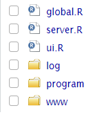
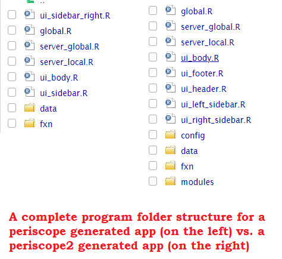

<!-- badges: start -->
[](https://CRAN.R-project.org/package=periscope2)
[](https://cran.r-project.org/package=periscope2)
[](https://app.circleci.com/pipelines/github/Aggregate-Genius/periscope2?branch=master)
[](https://app.codecov.io/gh/Aggregate-Genius/periscope2)
<!-- badges: end -->

### Overview

***periscope2*** is a scalable and UI-standardized 'shiny' framework including a variety of developer convenience functions with the goal of both streamlining robust application development and assisting in creating a consistent user experience regardless of application or developer.


***periscope2*** is full of developer-friendly features such as:

* Predefined but flexible templates for new Shiny applications with a default [bs4Dash](https://bs4dash.rinterface.com/) layout
* Separation by file of functionality that exists in one of the three shiny scopes: global, server-global, and server-local
* Generated applications are organized in an easy to follow and maintain folder structure based on files functionality
* Off-the-shelf and ready to be used modules ('Table Downloader', 'Plot Downloader', 'File Downloader' and 'Reset Application'
* Different methods and tools to alert users and add useful information about application UI and server operations
* Application logger with different levels and a UI tool to display and review recorded application logs
* Application look and feel can be customized easily via 'www/periscope_style.yaml' or more advanced via 'www/css/custom.css'
* Application can make use of JS power by customizing 'www/js/custom.js'

Create and run sample app for full features demo

```{r}
periscope2::create_application(name = "demo_app", location = ".", sample_app = T, right_sidebar = T)
shiny::runApp("./demo_app/", launch.browser = T)
```

### periscope vs periscope2
[periscope](https://cran.r-project.org/web/packages/periscope/index.html) is widely regarded and used an enterprise application development aid framework for providing the user with the ability to build a robust shiny applications and dashboards.

[periscope](https://cran.r-project.org/web/packages/periscope/index.html) is the direct ancestor of periscope2 in which periscope2 took most of its basic philosophy and generated applications structure.

However; as periscope2 is the next generation (iteration) of [periscope](https://cran.r-project.org/web/packages/periscope/index.html) package, they differ in many aspects as follow:

#### Underlying frameworks
[periscope](https://cran.r-project.org/web/packages/periscope/index.html) is dependent on bootstrap 3 supported shiny packages:

- [shinydashboard](https://cran.r-project.org/web/packages/shinydashboard/index.html)
- [shinydashboard Plus](https://cran.r-project.org/web/packages/shinydashboardPlus/index.html)
- [shinyBS](https://cran.r-project.org/web/packages/shinyBS/index.html)

While periscope2 is dependent only on bootstrap 4 supported shiny package to bring in more functionality (i.e dashboard functionality, alerts, tool-tips, etc..) and a modernized look and feel:

- [bs4Dash](https://cran.r-project.org/web/packages/bs4Dash/index.html)

----

#### Generated applications layout
[periscope](https://cran.r-project.org/web/packages/periscope/index.html) full generated app layout is simple as follow:

- Left sidebar
- Right sidebar
- Header
- Body

All above parts are customizable except for header, user can only update title part in it

However, periscope2 full generated app layout has the following structure:

- Left sidebar
- Right sidebar
- Header
- Footer
- Body

For periscope2, each part has it own UI R file that can customized and updated alone. Aslo, each part has its own dedicated alert panel except for header that has an additional alert panel for announcements framework.

User can adapt layout for both packages generated apps easily via related functions (refer to `r ?periscope` and `r ?periscope2` for more info)

-----

#### Generated applications code structure

- Regardless files contents, both packages generated applications share the same first level folder structure:

<center></center>

- After that, there are differences in next level structure as follow:
  - **program** folder, that contains application main logic, periscope2 has:
    - a dedicated UI R script for each layout part to control it
    - **config**  - folder for storing application different configuration files (it will evolve more in next versions)
      - Initially contains announcements module configuration file
    - **modules**  - folder for application shiny modules R scripts (it will evolve more in next versions)
    <center></center>
  - ***www*** folder that contains the application JS, CSS and theme customization files
    - Although generated applications by both frameworks will have the same folder structure, periscope2 generated applications will have two additional files **css/custom.css** and **js/custom.js** to have application custom JS and CSS code
      - Note that both files are already linked to generated app and ready to be used immediately by user

----

#### Packages modules

- Both packages share some modules (for now) as downloadable file, downloadable plot and downloadable table
- However, periscope2 has more modules (more to come with each new version) as Announcement module
- Also, there are modules that exist in both packages but behave a little differently than each other (i.e logger and Reset Application) modules
- Check both packages for each package modules details

----

#### Old Shiny module style support

While [periscope](https://cran.r-project.org/web/packages/periscope/index.html) modules can be called via shiny module old style (via `callModule` method) or using new shiny module style.  periscope2 modules can only be called using new shiny module style. Check [migrating to module server](https://shiny.posit.co/r/articles/improve/modules/#migrating-from-callmodule-to-moduleserver) article for more related technical info

----

#### fresh package Styling Support
[fresh](https://dreamrs.github.io/fresh/) package is used in both packages to style generated applications different parts via configurations rather than code via **'www/periscope_style.yaml'** file.

However, [shiny dashboard variables](https://dreamrs.github.io/fresh/articles/vars-shinydashboard.html) are used for styling [periscope](https://cran.r-project.org/web/packages/periscope/index.html) generated applications. While [bs4Dash related variables](https://dreamrs.github.io/fresh/articles/vars-bs4dash.html) are used for styling periscope2 generated applications but not via code only via **'www/periscope_style.yaml'** configuration file (hence the file key names are user friendly in both packages)

-----

### Installation

periscope2 is available for installation from the
latest version of ***periscope2*** from GitHub as follows:

```r
devtools::install_github('cb4ds/periscope2')
```

<br/>

---

### Examples

These are included to get you started. You can either start with an empty application or an application that includes samples of the components that you can use within your application.  There is extensive package documentation and full Vignettes are also available to help you with all the options.

<br/>

#### Empty application

```r
library(periscope2)
create_application('emptyapp', location = tempdir())
runApp('emptyapp')
```


#### Sample application - no right sidebar

```r
library(periscope2)
create_application("sampleapp1", location = tempdir(), sample_app = TRUE)
runApp('sampleapp1')

```

#### Sample application - including a right sidebar

```r
library(periscope2)
create_application("sampleapp2", location = tempdir(), sample_app = TRUE, rightsidebar = TRUE)
runApp('sampleapp2')

```
