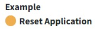
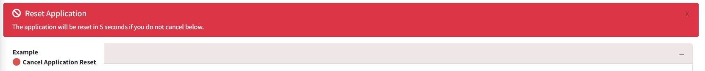
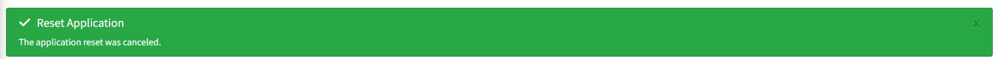
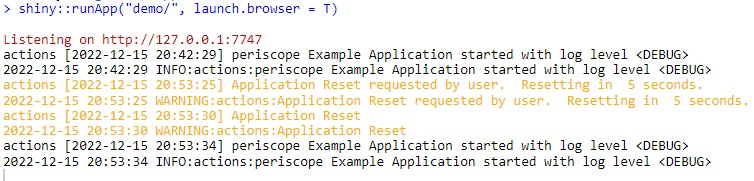
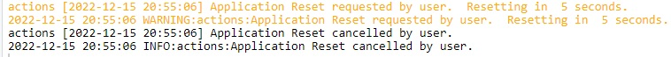

# Using the appReset Shiny Module

## Overview

### Purpose

This *Shiny Module* allows the user to easily reset application session
and logs

### Features

- Resets a user’s session
- Resets the session log

## Usage

### Shiny Module Overview

Shiny modules consist of a pair of functions that modularize, or
package, a small piece of reusable functionality. The UI function is
called directly by the user to place the UI in the correct location (as
with other shiny UI objects). The module server function that is called
only once to set it up using the module name as a function inside the
server function (i.e. user-local session scope. The function first
arguments is string represents the module id (the same id used in module
UI function). Additional arguments can be supplied by the user based on
the specific shiny module that is called. There can be additional helper
functions that are a part of a shiny module.

The **appReset** Shiny Module is a part of the *periscope2* package and
consists of the following functions:

- **appResetButton** - the UI function to place the button in the
- **appReset** - the UI function to place the button in the

### appResetButton



App Reset Toggle Button

- This is a toggle button can be placed in the UI like any other element

- This button is automatically wired to reset the application to the
  initial session state

- The user is given a warning (as an alert on the Advanced tab) and the
  reset is delayed (default = 5s) to allow the user to cancel the reset.



Reset Warning



Cancel Reset

- Reset requests and cancellations are logged automatically.
  
  Successful reset request



Canceled reset request

``` r
# Inside ui_body.R or similar UI file

appResetButton('appResetId')
```

### appReset

The **appReset** function is called directly. The call consists of the
following:

- the unique object ID
- the logging logger to be used

``` r
# Inside server_local.R

appReset(id = 'appResetId', logger = logger)
```

### Sample Application

For a complete running shiny example application using the appReset
module you can create and run a *periscope2* sample application using:

``` r
library(periscope2)

app_dir = tempdir()
create_application(name = 'mysampleapp', location = app_dir, sample_app = TRUE)
runApp(paste(app_dir, 'mysampleapp', sep = .Platform$file.sep))
```

  

**Vignettes**

- [New
  Application](https://aggregate-genius.github.io/periscope2/articles/new-application.md)
- [downloadableTable
  Module](https://aggregate-genius.github.io/periscope2/articles/downloadableTable-module.md)
- [downloadablePlot
  Module](https://aggregate-genius.github.io/periscope2/articles/downloadablePlot-module.md)
- [downloadFile
  Module](https://aggregate-genius.github.io/periscope2/articles/downloadFile-module.md)
- [logViewer
  Module](https://aggregate-genius.github.io/periscope2/articles/logViewer-module.md)
- [announcement
  Module](https://aggregate-genius.github.io/periscope2/articles/announcement-module.md)
- [Announcement Configuration
  Builder](https://aggregate-genius.github.io/periscope2/articles/announcement_addin.md)
- [Theme Configuration
  Builder](https://aggregate-genius.github.io/periscope2/articles/themeBuilder_addin.md)
- [downloadableReactTable
  Module](https://aggregate-genius.github.io/periscope2/articles/downloadableReactTable-module.md)
