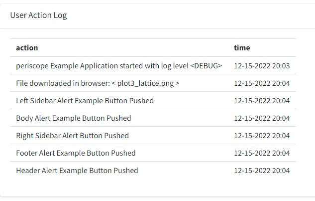

# Using the logViewer Shiny Module

## Overview

### Purpose

This *Shiny Module* displays recorded session logs in tabular format

### Features

- Table contains two columns:
  - action: describe the recorded action
  - time: display action time
- The log files are kept in the /log directory and named ‘actions.log’.
  ONE old copy of the log is kept as ’actions.log.last
- Many actions are automatically logged by the framework and it is easy
  for developers to add additional items as they see fit.
- Filtering logs by setting log_level argument as desired in
  set_app_parameters
  - “DEBUG” will log logdebug, loginfo, logwarn, and logerror messages
  - “INFO” will log loginfo, logwarn, and logerror messages
  - “WARNING” will log logwarn and logerror messages
  - “ERROR” will log logerror messages
- It is important to note that the log rolls over for each session and
  is reset if using the appReset module.



  

## Usage

### Shiny Module Overview

Shiny modules consist of a pair of functions that modularize, or
package, a small piece of reusable functionality. The UI function is
called directly by the user to place the UI in the correct location (as
with other shiny UI objects). The module server function that is called
only once to set it up using the module name as a function inside the
server function (i.e. user-local session scope. The first function
argument is a string that represents the module id (the same id used in
module UI function). Additional arguments can be supplied by the user
based on the specific shiny module that is called. There can be
additional helper functions that are a part of a shiny module.

The **logViewer** Shiny Module is a part of the *periscope2* package and
consists of the following functions:

- **logViewerOutput** - the UI function to place the button in the

### logViewerOutput

The **logViewerOutput** function is called from the ui_body.R (or
equivalent) file in the location where any other UI element (box) can be
placed.

``` r
# Inside ui_body.R

logViewerOutput("logViewerId")
```

### Sample Application

For a complete running shiny example application using the logViewer
module you can create and run a *periscope2* sample application using:

``` r
library(periscope2)

app_dir = tempdir()
create_application(name = 'mysampleapp', location = app_dir, sample_app = TRUE)
runApp(paste(app_dir, 'mysampleapp', sep = .Platform$file.sep))
```

  

## Additional Resources

**Vignettes**

- [New
  Application](https://aggregate-genius.github.io/periscope2/articles/new-application.md)
- [downloadableTable
  Module](https://aggregate-genius.github.io/periscope2/articles/downloadableTable-module.md)
- [downloadablePlot
  Module](https://aggregate-genius.github.io/periscope2/articles/downloadablePlot-module.md)
- [downloadFile
  Module](https://aggregate-genius.github.io/periscope2/articles/downloadFile-module.md)
- [applicationReset
  Module](https://aggregate-genius.github.io/periscope2/articles/applicationReset-module.md)
- [announcement
  Module](https://aggregate-genius.github.io/periscope2/articles/announcement-module.md)
- [Announcement Configuration
  Builder](https://aggregate-genius.github.io/periscope2/articles/announcement_addin.md)
- [Theme Configuration
  Builder](https://aggregate-genius.github.io/periscope2/articles/themeBuilder_addin.md)
- [downloadableReactTable
  Module](https://aggregate-genius.github.io/periscope2/articles/downloadableReactTable-module.md)
