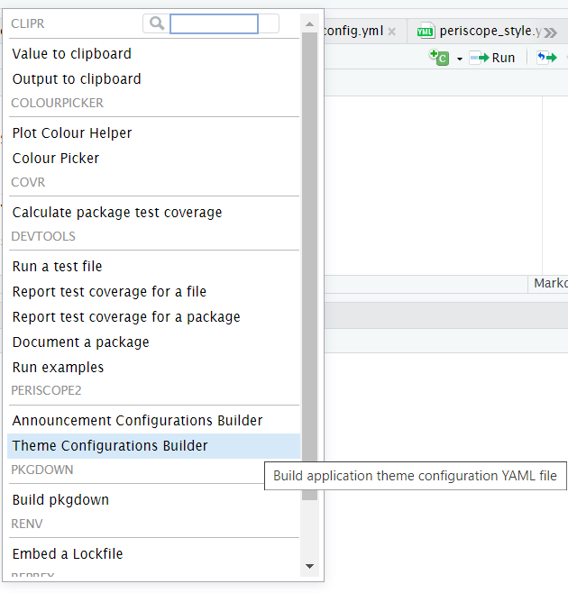
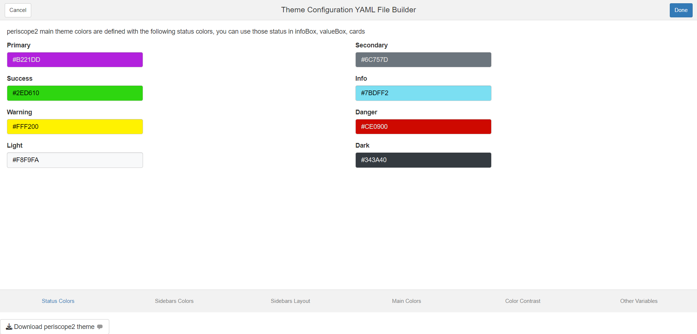
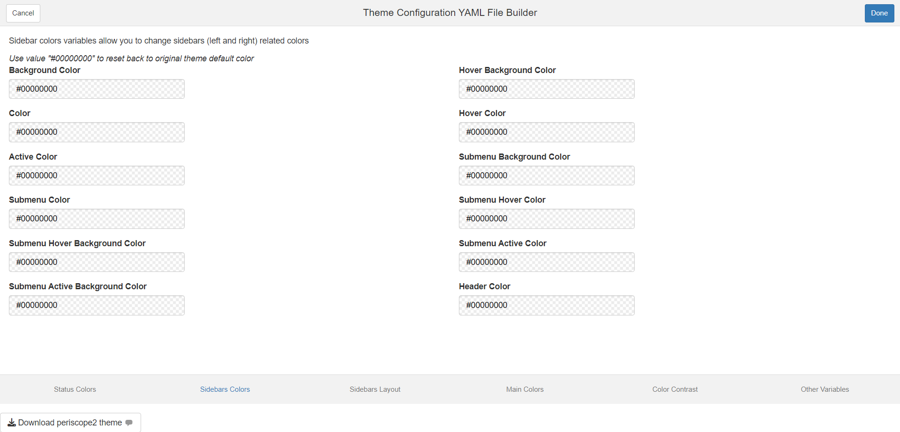
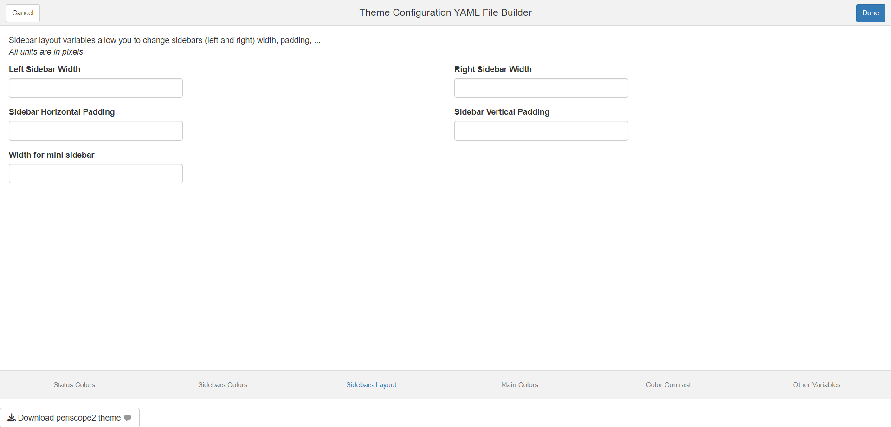
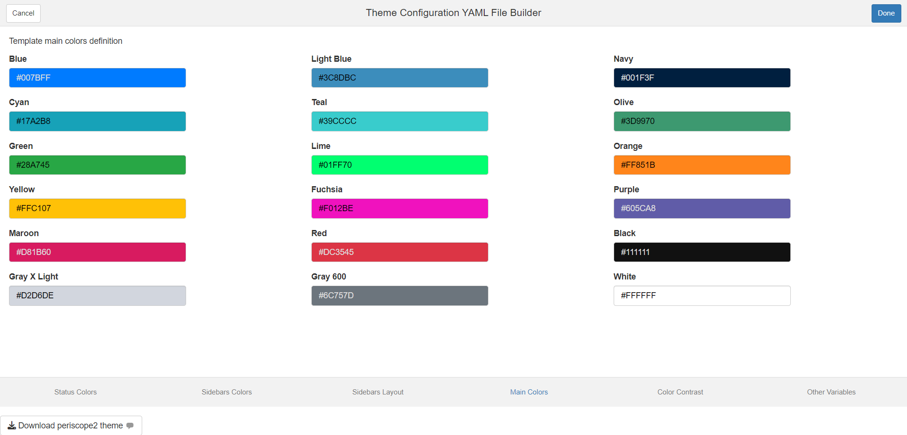
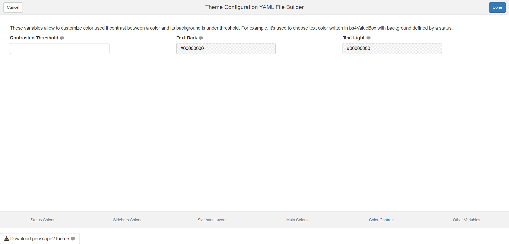
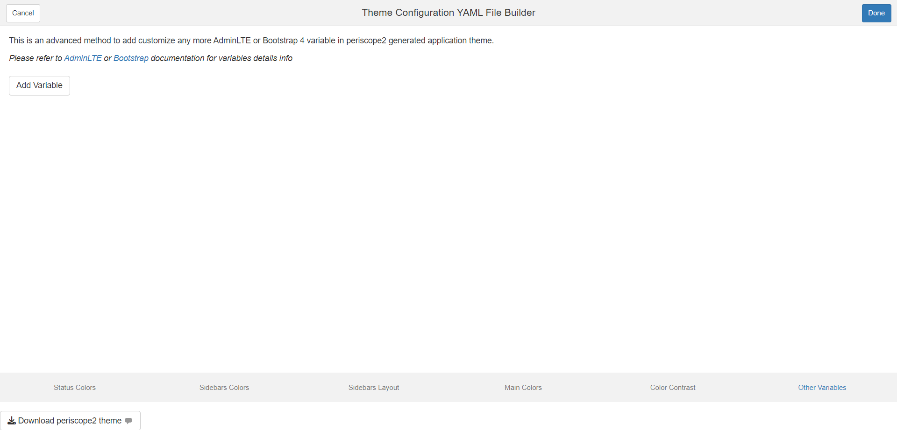
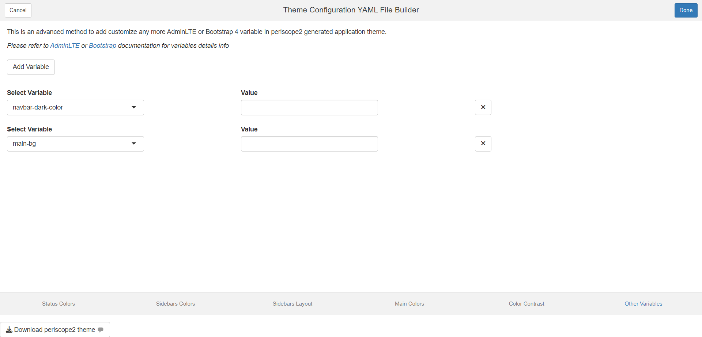
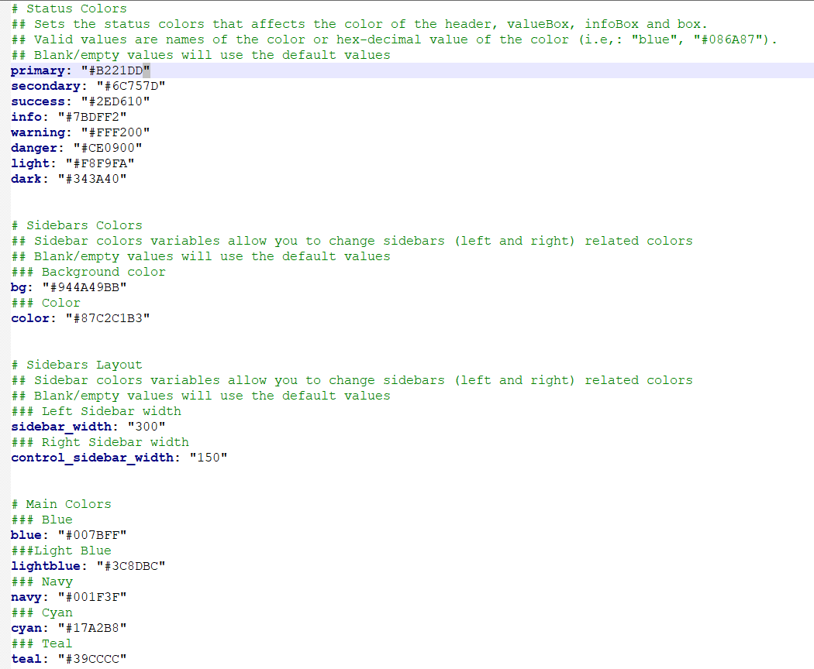

# Theme Configuration Builder

## Overview

To help package users in creating valid theme configuration file.

## Add-in Launch

The add-in can be launched by one of two methods - Call
`periscope2:::themeConfigurationsAddin()` function from within RStudio
console - From RStudio add-ins menu

Add-in Launch

## Add-in Layout

- The add-in will open as web browser tab
- Add-in UI consists of:
  - Header
  - Body
  - Footer
- Add-in header that consists of:
  - Cancel/Done buttons: they are default add-ins buttons and their sole
    purpose is to close add-in window
    - Upon Clicking on it, the widget add-in will be closed
  - Done button functionality can be customized but that is not needed
    in this add-in
    - Upon Clicking on it, the widget add-in will be closed
  - Add-in title between the two buttons is: “Theme Configuration YAML
    File Builder”
- Add-in body consists of 6 tabs:
  - Status Colors
  - Sidebar Colors
  - Sidebar layout
  - Main Colors
  - Colors Contrast
  - Other Variables
- Footer:
  - Download button
- No mandatory fields

## Status Colors Tab

periscope2 main theme colors are defined with the following status
colors, you can use those status in infoBox, valueBox, cards

## Sidebar Colors Tab

Sidebar colors variables allow you to change sidebars (left and right)
related colors

## Sidebar layout Tab

Sidebar layout variables allow you to change sidebars (left and right)
width, padding, …

## Main Colors Tab

Template main colors definition

## Colors Contrast Tab

These variables allow to customize color used if contrast between a
color and its background is under threshold. For example, it’s used to
choose text color written in bs4ValueBox with background defined by a
status

## Other Variables Tab

This is an advanced method to add or customize any more AdminLTE or
Bootstrap 4 variable in periscope2 generated application theme.

- User can add variables to customize by clicking “Add Variable” button
- User can remove added variables by adding remove button for that
  variable
- User can search for the theme variable in the selectize input

## Download Button

- Function: Download theme configuration yaml file
- Label: “Download”

## Downloaded File

Name: periscope_style.yaml Format: Value are based on input
configuration but output is similar to the following

## Downloaded Configuration File Usage

The generated file is used by putting it inside the generated app www
folder where it will be located by default

- [announcement
  Module](https://aggregate-genius.github.io/periscope2/articles/announcement-module.md)
- [Announcement Configuration
  Builder](https://aggregate-genius.github.io/periscope2/articles/announcement_addin.md)
- [New
  Application](https://aggregate-genius.github.io/periscope2/articles/new-application.md)
- [downloadableTable
  Module](https://aggregate-genius.github.io/periscope2/articles/downloadableTable-module.md)
- [downloadablePlot
  Module](https://aggregate-genius.github.io/periscope2/articles/downloadablePlot-module.md)
- [downloadFile
  Module](https://aggregate-genius.github.io/periscope2/articles/downloadFile-module.md)
- [logViewer
  Module](https://aggregate-genius.github.io/periscope2/articles/logViewer-module.md)
- [applicationReset
  Module](https://aggregate-genius.github.io/periscope2/articles/applicationReset-module.md)
- [downloadableReactTable
  Module](https://aggregate-genius.github.io/periscope2/articles/downloadableReactTable-module.md)
