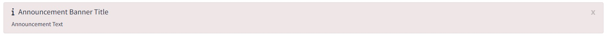

# Overview

## Purpose 

This *Shiny Module* was created in order to display announcements for app users

## Features

* Announcements module aim to alert app user with customized admin messages upon application start for predefined time.

# Usage

## Shiny Module Overview

Shiny modules consist of a pair of functions that modularize, or package, a 
small piece of reusable functionality.  The UI function is called directly by
the user to place the UI in the correct location (as with other shiny UI
objects). The module server function that is called only once to set it up using the
module name as a function inside the server function (i.e. user-local session
scope.  The function first arguments is string represents the module id (the same id used in module UI function). Additional arguments can be supplied by the user based on the specific shiny module that is called.  There can be additional helper functions that are a part of a shiny module.

The **announcements** Shiny Module is a part of the *periscope2* package and 
consists of the following function:

* **load_announcements** - parses announcements configuration file and load announcements if any

## load_announcements

* This function is configured in *server.R* and no need to modify it
* The function returns number of seconds in which an announcement should stay in application header (default is 30s)

```{r, eval=F}
# Inside server.R

    announce_close_time <- load_announcements()
    if (!is.null(announce_close_time)) {
        shinyjs::delay(announce_close_time,{
            bs4Dash::closeAlert("announceAlert") 
        })
    }
```

* Announcements will be displayed in a banner in app header, in which it will closed automatically.
  * If `auto_close` parameter in configuration file is blank, the announcement will only be closed manually.

<figure>
  <center></center>
  <figcaption>Announcements Bannar</figcaption>
</figure>

## Announcements configuration file

* Default configuration file name is `announce.yaml` and located under `program\config` folder
* If file does not exist or mis-configured, no announcements will be loaded
* File template has its own documentation to explain each parameter possible value and how it can be used

<figure>
  <center></center>
  <figcaption>Announcements Bannar</figcaption>
</figure>

* File location should be passed to `set_app_parameters` function in `program\global.R`

```{r, eval=F}
# Inside program\global.R

set_app_parameters(title              = "periscope Example Application",
                   app_info           = HTML("Demonstrat periscope features and generated application layout"),
                   log_level          = "DEBUG",
                   app_version        = "1.0.0",
                   loading_indicator  = list(html = tagList(spin_1(), "Loading ...")),
                   announcements_file = "./program/config/announce.yaml")
```


## Sample Application

For a complete running shiny example application using the annoucements
module you can create and run a *periscope2* sample application using:

```{r, eval=F}
library(periscope2)

app_dir = tempdir()
create_application(name = 'mysampleapp', location = app_dir, sample_app = TRUE)
runApp(paste(app_dir, 'mysampleapp', sep = .Platform$file.sep))
```

<br>

**Vignettes**

* [New Application](new-application.html)
* [downloadableTable Module](downloadableTable-module.html)
* [downloadablePlot Module](downloadablePlot-module.html)
* [downloadFile Module](downloadFile-module.html)
* [logViewer Moule](logViewer-moule.html)
* [applicationReset Moule](applicationReset-module.html)
