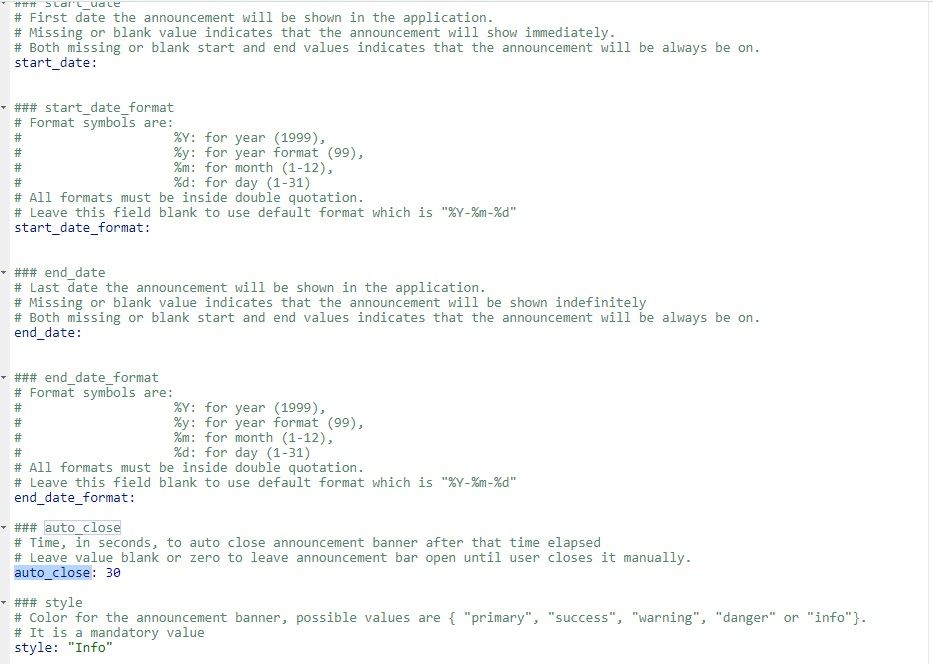

# Overview

## Purpose 

This *Shiny Module* displays announcements for app users at the top of an application.  It is a great location for administrative announcements, feature release notes, or any other global user messages.

## Features

* Provides an alert/banner message to the app user with customized messages upon application start
* Predefined start/end times allow for configurable message handling.

# Usage

## Shiny Module Overview

Shiny modules consist of a pair of functions that modularize, or package, a small piece of reusable functionality.  The UI function is called directly by the user to place the UI in the correct location (as with other shiny UI objects). The module server function that is called only once to set it up using the module name as a function inside the server function (i.e. user-local session scope.  The first function argument is a string that represents the module id (the same id used in module UI function). Additional arguments can be supplied by the user based on the specific shiny module that is called.  There can be additional helper functions that are a part of a shiny module.

The **announcements** Shiny Module is a part of the *periscope2* package and does not have any public functions.  See below for configuration details.


## Usage

<figure>
  <center></center>
  <figcaption>Announcements Banner Example</figcaption>
</figure>

* Announcements will be displayed in a banner in app header
  * If `auto_close` is set, the announcement will close automatically after the specified time (in seconds).  The user can close the announcement earlier if they desire.
  * If `auto_close` parameter in configuration file is blank, the announcement will only be closed manually by the user clicking on the X in the top right corner.
  * Start and End dates can be set optionally.  If unset the banner will always be shown
  * Styling according to basic bootstrap styles can be specified, changing the color of the banner to indicate different priorities or information importance, etc.
  * Title and Text can be specified

## Announcements configuration file

* Default configuration file name is `announce.yaml` and located under `program\config` folder
* If file does not exist or is mis-configured, no announcements will be loaded
* This file template has its own documentation to explain each parameter possible value and how it can be used including:
  * start_date and start_date_format
  * end_date and end_date format
  * auto_close
  * style
  * title
  * text

<figure>
  <center></center>
  <figcaption>Announcements Banner Configuration File</figcaption>
</figure>

* The announcements configuration file location should be passed to `set_app_parameters` function in `program\global.R`

```{r, eval=F}
# Inside program\global.R

set_app_parameters(title              = "periscope Example Application",
                   app_info           = HTML("Demonstrate periscope features and generated application layout"),
                   log_level          = "DEBUG",
                   app_version        = "1.0.0",
                   loading_indicator  = list(html = spin_1(), color = 'rgba(22, 65, 124, 0.3)'),
                   announcements_file = "./program/config/announce.yaml")
```


## Sample Application

For a complete running shiny example application using the announcements module you can create and run a *periscope2* sample application using:

```{r, eval=F}
library(periscope2)

app_dir = tempdir()
create_application(name = 'mysampleapp', location = app_dir, sample_app = TRUE)
runApp(paste(app_dir, 'mysampleapp', sep = .Platform$file.sep))
```

<br>

**Vignettes**

* [Announcement Configuration Builder](announcement_addin.html)
* [New Application](new-application.html)
* [downloadableTable Module](downloadableTable-module.html)
* [downloadablePlot Module](downloadablePlot-module.html)
* [downloadFile Module](downloadFile-module.html)
* [logViewer Module](logViewer-module.html)
* [applicationReset Module](applicationReset-module.html)
* [Theme Configuration Builder](themeBuilder_addin.html)
