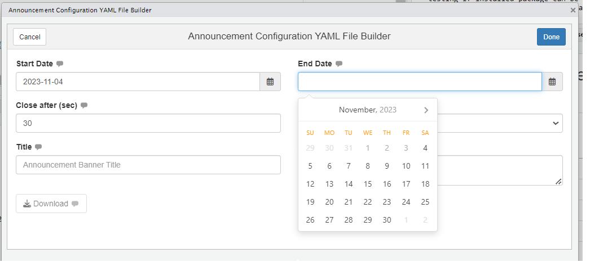
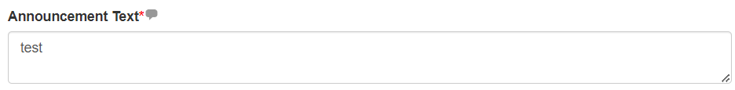

## Overview
To help package users in creating valid announcement configuration file

## Add-in Launch

The add-in can be launched by one of two methods

- Call **periscope2:::announcementConfigurationsAddin()** function from within RStudio console
- From RStudio add-ins menu

{#fig-1}

## Add-in Layout

- The add-in will open as browser tab
- Add-in UI consists of:
  - Header
  - Body
- Add-in header that consists of:
  - Cancel/Done buttons: they are default add-ins buttons and their solo purpose is to close add-in window
  - Done button functionality can be customized but that is not needed in this add-in
  - Add-in title between the two buttons is: "Announcement Configuration YAML File Builder"
- Add-in body:
  - Start Date
  - End Date
  - Close after (sec)
  - Style
  - Title
  - Announcement Text
  - Download button

## Inputs
### Start Date and End Date

- **Function**: Determine when announcement will start and when it will end
- **Default value**: NULL
- **Tooltips**:
  - Start Date:`First date the announcement will be shown in the application.
                Missing or blank value indicates that the announcement will show immediately.
                Both missing or blank start and end values indicates that the announcement will be always be on.`
  - End Date: `Last date the announcement will be shown in the application. Missing or blank value indicates that the announcement will be shown indefinitely. Both missing or blank start and end values indicates that the announcement will be always be on.`
- **Input calendar default value**: current day
- Date Rules
  - Either of Start/End dates inputs or both can be NULL
  - Start Date calendar minimum date will always be current day (use won't be able to select earlier days)
  - End Date calendar minimum date will be either
    - Current day if start date  is NULL
    - or start date day if it is selected as below
    

    
  - If user selected an end date before selecting start date, then select a start date that is later than end date, end date will be updated to the selected start date
  

### Close after (sec)

 - **Function**: Numeric input to determine how long announcement should be displayed
- * *Default value**: 30
- **Tooltip**: "Time, in seconds, to auto close announcement banner after that time elapsed. Leave value blank or zero to leave announcement bar open until user closes it manually."
Input Rules:
Value can be 0 or NULL
It cannot be characters
It cannot be Negative

{#fig-7}

### Style

- **Function**: Dropdown to select announcement alert color
- **Default value**: primary
- **Tooltip**: "Color for the announcement banner, possible values are {'primary', 'success', 'warning', 'danger' or 'info'}. It is a mandatory value."
- **Input Rules**:
  - It cannot be NULL
  - It cannot have a different value than what is listed in the dropdown
  

### Title
- **Function**: Set announcement title 
- **Default value**: empty
- **Tooltip**: "Optional banner title. Leave it empty to disable it"
- **Input Rules**: It is not mandatory
- **Placeholder**: "Announcement Banner Title"

{#fig-9}

### Announcement Text

- **Function**: Set announcement body
- **Default value**: empty
- **Tooltip**: "The announcement text. Text can contain html tags and is a mandatory value"
- **Input Rules**: It is mandatory
- **Placeholder**: "Announcement Banner Title"
- Its size can be increased only by dragging the bottom left corner

### Download button

- **Function**: Download announcement configuration yaml file
- **Default State**: Disabled
- **Rules**: It will be enabled if all mandatory inputs are provided and valid
- **Label**: "Download"

### Downloaded File

- **Name**: announce.yaml
- **Format**: Value are based on input configuration but output is similar to the following

For detailed usage for that file refer to [announcement Module](announcement-module.html).

**Vignettes**

* [announcement Module](announcement-module.html)
* [New Application](new-application.html)
* [downloadableTable Module](downloadableTable-module.html)
* [downloadablePlot Module](downloadablePlot-module.html)
* [downloadFile Module](downloadFile-module.html)
* [logViewer Module](logViewer-module.html)
* [applicationReset Module](applicationReset-module.html)
