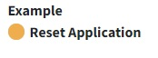
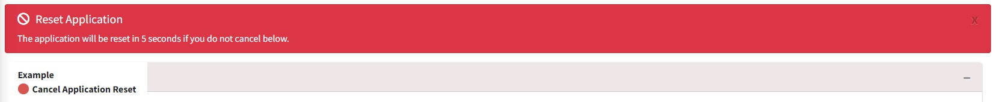
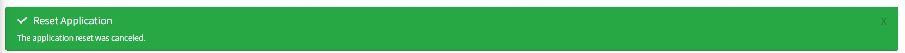
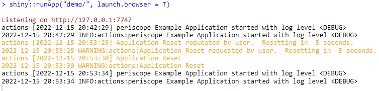
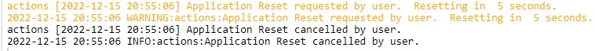

# Overview

## Purpose 

This *Shiny Module* was created in order to reset application session and logs

## Features

* Resets a user's session
* Rolls over their log

# Usage

## Shiny Module Overview

Shiny modules consist of a pair of functions that modularize, or package, a 
small piece of reusable functionality.  The UI function is called directly by
the user to place the UI in the correct location (as with other shiny UI
objects). The module server function that is called only once to set it up using the
module name as a function inside the server function (i.e. user-local session
scope.  The function first arguments is string represents the module id (the same id used in module UI function). Additional arguments can be supplied by the user based on the specific shiny module that is called.  There can be additional helper functions that are a part of a shiny module.

The **appReset** Shiny Module is a part of the *periscope2* package and 
consists of the following functions:

* **appResetButton** - the UI function to place the button in the 
* **appReset** - the UI function to place the button in the 

## appResetButton

* It is a toggle button can be placed at any place in ui like any other ui element. 

<figure>
  <center></center>
  <figcaption>App Reset Toggle Button</figcaption>
</figure>

* This button is automatically wired to reset the application to the initial
session state. 
* The user is given a warning (as an alert on the Advanced tab)
and the reset is delayed (default = 5s) to allow the user to cancel the reset.

<figure>
  <center></center>
  <figcaption>Reset application warning</figcaption>
</figure>


<figure>
  <center></center>
  <figcaption>Cancel reset application</figcaption>
</figure>

* Reset requests and cancellations are logged automatically.
<figure>
  <center></center>
  <figcaption>Successful reset application</figcaption>
</figure>

<figure>
  <center></center>
  <figcaption>Canceled reset application</figcaption>
</figure>


```{r, eval=F}
# Inside ui_body.R or similar ui file

appResetButton('appResetId')
```

## appReset

The **appReset** function is called directly. The call consists of the following:

* the unique object ID 
* the logging logger to be used

```{r, eval=F}
# Inside server_local.R

appReset(id = 'appResetId', logger = logger)
```


## Sample Application

For a complete running shiny example application using the appReset
module you can create and run a *periscope2* sample application using:

```{r, eval=F}
library(periscope2)

app_dir = tempdir()
create_application(name = 'mysampleapp', location = app_dir, sample_app = TRUE)
runApp(paste(app_dir, 'mysampleapp', sep = .Platform$file.sep))
```

<br>

**Vignettes**

* [New Application](new-application.html)
* [downloadableTable Module](downloadableTable-module.html)
* [downloadablePlot Module](downloadablePlot-module.html)
* [downloadFile Module](downloadFile-module.html)
* [logViewer Module](logViewer-module.html)
* [announcement Module](announcement-module.html)
