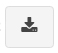
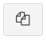
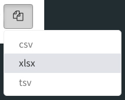

# Overview

## Purpose 

This *Shiny Module* provides a consistent-looking and easy-to-use button that facilitates single or multiple types of file downloads.

## Features

* Auto-adjusts the button image and styling for single or multiple downloads
* Ability to link different data sets to different file types if desired
* Incorporates tooltips and drop-downs automatically
* Converts data to various download types
* Requires minimal code (see the Usage section for details)

<br>

# Usage

## Shiny Module Overview

Shiny modules consist of a pair of functions that modularize, or package, a small piece of reusable functionality.  The UI function is called directly by the user to place the UI in the correct location (as with other shiny UI objects). The module server function that is called only once to set it up using the module name as a function inside the server function (i.e. user-local session scope.  The first function argument is a string that represents the module id (the same id used in module UI function). Additional arguments can be supplied by the user based on the specific shiny module that is called.  There can be additional helper functions that are a part of a shiny module.

The **downloadableTable** Shiny Module is a part of the *periscope2* package and 
consists of the following functions:

The **downloadFile** Shiny Module is a part of the *periscope2* package and  consists of the following functions:

* **downloadFileButton** - the UI function to place the button in the 
application.
* **downloadFile** - the server function to be called inside server_local.R.
* Helper Functions:
  * **downloadFile_ValidateTypes** - will check a given list of file types and warn the caller if the list contains an invalid or unsupported type.
  * **downloadFile_AvailableTypes** - will return a vector of supported file types.

## downloadFileButton

The **downloadFileButton** function is called from the ui.R (or equivalent) file in the location where the button should be placed.  This is similar to other UI element placement in shiny.

The downloadFileButton function takes the unique object ID for the UI object.

The next two arguments (downloadtypes and hovertext) set the file types the button will allow the user to request and the tooltip text.  

If only one download type is given the button will be a single-download type of button
that starts the specified download when the button is pressed.  The button will 
look like:

<center></center>


If more than one type is given there will be a dropdown choice given to the user
when the button is pressed and the download will start when the choose one of 
the types.  The dropdown choices will be in the order given by the call to the
function.  The button and dropdown will look like:

<center>


</center>


```{r, eval=F}
# Inside ui_body.R or ui_sidebar.R

#single download type
downloadFileButton(id            = "object_id1", 
                   downloadtypes = c("csv"), 
                   hovertext     = "Button 1 Tooltip")

#multiple download types
downloadFileButton(id            = "object_id2", 
                   downloadtypes = c("csv", "tsv"), 
                   hovertext     = "Button 2 Tooltip")
```

## downloadFile

The **downloadFile** function is called directly. The call consists of the following:

**Note on Excel file support:** For xlsx files, the module will first attempt to use `openxlsx2` if available, then fall back to `openxlsx`, and finally use `writexl` if neither is available. We recommend `openxlsx2` for best performance with Excel files.


* the unique object ID that was provided to downloadFileButton when creating 
the UI object
* the logging logger to be used
* the root (prefix) of the downloaded file name to be used in the browser as a character
string or reactive expression that returns a character string
* a **named list** of functions or reactive expressions that provide the data (see below).  
  * It is important that the types of files to be downloaded are matched to the correct data function in the list.  
  * The function/reactive expression names are unquoted - they will be called at the time the user initiates a download *(see requirements below)*.

**Data Function or Reactive Expression Requirements**

* If a function is provided it must be parameter-less (require NO parameters).  No parameters will be provided when a function is called to retrieve the plot or data.  Reactive expressions cannot take parameters by definition.
* The function or reactive expression must return an appropriate data format for the file type.  For
instance: csv/tsv/xlsx types require data that is convertible to a tabular type.
* Since the function or reactive expression is called at the time the user requests the data it is 
recommended that reactive expressions are used to provide dynamic values from the application to create the plot.


```{r, eval = F}
# Inside server_local.R

#single download type
downloadFile(id           = "object_id1", 
             logger       = ss_userAction.Log,
             filenameroot = "mydownload1",
             datafxns     = list(csv = mydatafxn1),
             aspectratio  = 1)

#multiple download types
downloadFile(id           = "object_id2",
             logger       = ss_userAction.Log,
             filenameroot = "mytype2",
             datafxns     = list(csv = mydatafxn1, xlsx = mydatafxn2),
             aspectratio  = 1)
```


## Sample Application

For a complete running shiny example application using the downloadFile module you can create and run a *periscope2* sample application using:

```{r, eval=F}
library(periscope2)

app_dir = tempdir()
create_application(name = 'mysampleapp', location = app_dir, sample_app = TRUE)
runApp(paste(app_dir, 'mysampleapp', sep = .Platform$file.sep))
```

<br>

# Additional Resources


**Vignettes**

* [New Application](new-application.html)
* [downloadableTable Module](downloadableTable-module.html)
* [downloadablePlot Module](downloadablePlot-module.html)
* [logViewer Module](logViewer-module.html)
* [applicationReset Module](applicationReset-module.html)
* [announcement Module](announcement-module.html)
* [Announcement Configuration Builder](announcement_addin.html)
* [Theme Configuration Builder](themeBuilder_addin.html)
* [downloadableReactTable Module](downloadableReactTable-module.html)
