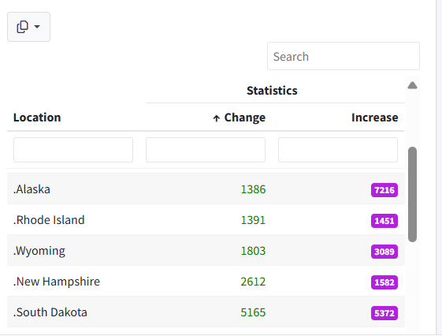

# Overview

## Purpose 
The document explains how to use **downloadableReactTable** shiny module in periscope2 applications.

## Features
* Ability to display and download datasets.
* Table rows selection can be multiple, single or none (the default)
  * When selection mode is enabled an additional column will be added to the table
  * The selection controls will be radio buttons for single row selection and checkboxes for "multiple" rows selection mode
* Returns a reactive expression containing named list with two elements:
  * **selected_rows**: data.frame of current selected rows
  * **table_state**: a list of current rendered table state values. The list keys are ("page", "pageSize", "pages", "sorted" and "selected")
* Supports full-table searching including regular expressions
* Columns are sort-able in both directions
* Configurable table "window" (viewing area) height with infinite vertical 
scrolling (no paging by default)
* Supports rownames 
* Requires minimal code (see the Usage section for details)
* Uses **downloadFile** Shiny Module functionality to ensure consistent
download functionality for table data.
* **downloadFile** button will be hidden if `downloadableReactTable` parameter `download_data_fxns` or
`downloadableReactTableUI` parameter `downloadtypes` is empty

# Usage

## Shiny Module Overview
Shiny modules consist of a pair of functions that modularize, or package, a small piece of reusable functionality.  The UI function is called directly by the user to place the UI in the correct location (as with other shiny UI objects). The module server function that is called only once to set it up using the module name as a function inside the server function (i.e. user-local session scope.  The first function argument is a string that represents the module id (the same id used in module UI function). Additional arguments can be supplied by the user based on the specific shiny module that is called.  There can be additional helper functions that are a part of a shiny module.

The **downloadableReactTable** Shiny Module is a part of the *periscope2* package and 
consists of the following functions:

* **downloadableReactTableUI** - the UI function to place the table in the application
* **downloadableReactTable** - the server function to be called inside server_local.R.

## downloadableReactTableUI

The **downloadableReactTableUI** function is called from the ui.R (or equivalent) 
file in the location where the table should be placed.  This is similar to other
UI element placement in shiny.

The downloadableReactTableUI looks like:

<center></center>

The downloadableReactTableUI function takes the unique object ID for the UI object.

The next two arguments (downloadtypes and hovertext) are passed to the
downloadFileButton and set the file types the button will allow the user to
request and the downloadFileButton's tooltip text.  


```{r, eval=F}
# Inside ui_body.R or ui_sidebar.R

 downloadableReactTableUI(
             id            = "object_id1",
             downloadtypes = c("csv", "tsv"),
             hovertext     = "Download the data here!")
```

## downloadableReactTable

## Sample Application

# Additional Resources


**Vignettes**

* [New Application](new-application.html)
* [downloadFile Module](downloadFile-module.html)
* [downloadablePlot Module](downloadablePlot-module.html)
* [logViewer Module](logViewer-module.html) 
* [applicationReset Module](applicationReset-module.html)
* [announcement Module](announcement-module.html)
* [Announcement Configuration Builder](announcement_addin.html)
* [Theme Configuration Builder](themeBuilder_addin.html)
