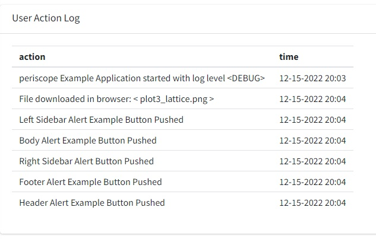

# Overview

## Purpose 

This *Shiny Module* was created in order to display recorded logs in tabular format

## Features

* It is important to note that the log rolls over for each session. 
* The log files are kept in the /log directory and named 'actions.log'. ONE old copy of the log is kept as 'actions.log.last 
* Table contains two columns:
  * action: describe the recorded action
  * time: display action time
  
<center></center>
<br>

# Usage

## Shiny Module Overview

Shiny modules consist of a pair of functions that modularize, or package, a 
small piece of reusable functionality.  The UI function is called directly by
the user to place the UI in the correct location (as with other shiny UI
objects). The module server function that is called only once to set it up using the
module name as a function inside the server function (i.e. user-local session
scope.  The function first arguments is string represents the module id (the same id used in module UI function). Additional arguments can be supplied by the user based on the specific shiny module that is called.  There can be additional helper functions that are a part of a shiny module.

The **LogViewer** Shiny Module is a part of the *periscope2* package and 
consists of the following functions:

* **logViewerOutput** - the UI function to place the button in the 

## logViewerOutput

The **logViewerOutput** function is called from the ui_body.R (or equivalent) file 
in the location where any other box can be placed.  

```{r, eval=F}
# Inside ui_body.R

logViewerOutput("logViewerId")
```


# Additional Resources


**Vignettes**

* [New Application](new-application.html)
* [downloadableTable Module](downloadableTable-module.html)
* [downloadablePlot Module](downloadablePlot-module.html)
* [downloadFile Module](downloadFile-module.html)
