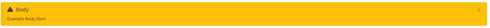
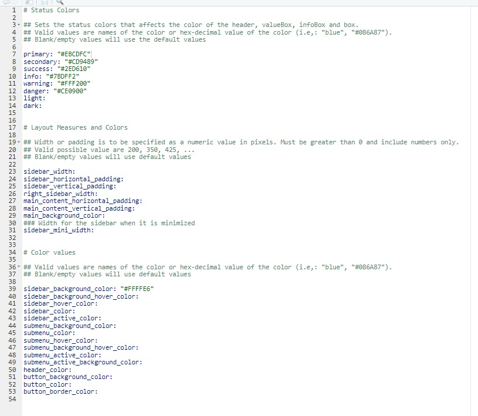

# Overview

## Purpose

As an extension of [periscope](https://cran.rstudio.com/web/packages/periscope/index.html) package, periscope2 was created for the express purpose of making it easy for shiny developers to create consistent-looking and functioning applications with more advanced UI functionality and modern looking.  This is important because it reduces the time a user must spend to learn the interface for new applications (this reducing application support time and increasing
the user's satisfaction across applications).

In addition to creating a consistent UI experience this framework reduces development time for new applications by removing some of the boilerplate aspects of new applications such as alerting, logging, etc.

<br>

## UI Sections
periscope2 layout depends on [bs4Dash](https://rinterface.github.io/bs4Dash/index.html) layout
as each application can have up to main 5 sections.

<center></center>

*1: Left Sidebar*

The left sidebar is reserved for configuration options, settings, and general user
application controls and functionality that will affect the body of the
application.

Left sidebar supports any shiny UI element. Also, to have a multiple pages app,
user also can add menu items in which each item can be linked to a separate body page.

The left sidebar can be collapsed in desktop mode to maximize the user's view of the
application body when they do not immediately need the configuration options and
settings. Also, it is possible to create an application without a left sidebar.

*2: Header*

periscope2 uses header to display new application information, which is provided by user,
and application title.

It is also used for displaying session busy indicator and announcements alerts.

Header can also be used to add custom menu items to link to other apps, pages or any custom functions.

*3: Right Sidebar*

The right sidebar is, like the left sidebar, reserved for configuration options, settings,
and general user application controls and functionality that will affect the body of the
application.

The right sidebar is collapsed by default, it can be opened by clicking on the (customizable) icon.
Also, it is possible to create an application without a right sidebar.

*4: Footer*

Footer supports textual or html formatted info or citation about application.
Also, it is possible to create an application without a footer.

*5: Body*

This is the main body area for applications where charts and figures, tables,
etc. are placed by the application developer.  If desired the developer can
add multiple pages and switch among them from left sidebar, or right sidebar.


<br>

## Features

### New Application Template Generation

* **Empty application** - ready for the user to drop in their code!
* **Sample application** - demonstrates framework features in a working application


### Built-in Conveniences

#### Responsive UI

The application layout will adapt to user device size automatically

#### Application Busy Indicator

This indicator shows in the header bar automatically when the shiny application
is busy.  There is no application developer code necessary to tie into this
functionality.

<center></center>

#### Logging

The framework makes it easy to log user actions.  Framework user interactions
are automatically logged. Recorded logs can be viewed automatically using logViewer module


```{r, eval=F}
# Add a user action to the log
loginfo("Your Information Message with %s, %s parameters", parm1, parm2, logger = ss_userAction.Log)

logwarn("Your Warning Message!", logger = ss_userAction.Log)
```

*Examples of app log in console:*

<center></center>

#### Alerting

There are five standardized locations for user-alerts:

- left sidebar,
<center></center>
- application header,
<center></center>
- the top of the body,
<center></center>
- right sidebar,
<center></center>
- and footer
<center></center>

All the alerts are dismissible by the user and can be colored by setting the
status.

Alerts can accumulate (i.e. append to each other) or replace previous alerts.

*Code Example*

```{r, eval=F}
periscope2::createAlert('alert place',
                         options = list(title    = 'alert title',
                         status   = 'alert status'',
                         closable = TRUE,
                         content  = alert contents))
# 'alert place' can be: 'sidebarRightAlert', 'sidebarBasicAlert', 'bodyAlert', 'footerAlert' and 'headerAlert'
# 'alert status': 'primary', 'success', 'warning', 'danger' or 'info'.

```

#### Application Loading

An indicator that displayed upon application start up or reload and it can be customized in 'program/global.R'

<center></center>

#### UI Tooltips

Tooltips can be added with the following code in the UI:

```{r, eval=F}
U: ui_tooltip('tooltipID', 'label text (optional)', 'text content', 'placement' (optional))

# 'placement': 'top', 'bottom', 'left'and 'right'

```

<center></center>


### Shiny Modules

#### downloadFile

This is a high-functionality set of custom-styled buttons with the built-in
ability to download data in different file formats.

*See the downloadFileButton Vignette for more detailed information*

#### downloadableTable

This is a high-functionality custom styled table that includes a
downloadFileButton linked to the data.

*See the downloadableTable Vignette for more detailed information*

#### downloadablePlot

This is a custom plot output that is paired with a linked downloadFile button
which allows the user to download the plot in different file formats.

*See the downloadablePlot Vignette for more detailed information*

#### Announcement Module

It aims to alert app user with customized admin messages upon application start for predefined time. Module can be configured via 'program/config/announce.yaml' 

*See the Announcement Vignette for more detailed information*

#### Application Reset

Resets a user's session and rolls over their log. 

*See the Application Reset Vignette for more detailed information*

#### Log Viewer

View application recorded log 

*See the Log Viewer Vignette for more detailed information*

<br>

# Creating a Sample Application

## Step 1: Generate

```{r, eval=F}
library(periscope2)

app_dir = tempdir()
# application without a right sidebar or footer
create_application(name = 'mytestapp', location = app_dir, sample_app = TRUE)
# application without a left sidebar, a right sidebar or footer
create_application(name = 'mytestapp', location = app_dir, sample_app = TRUE, left_sidebar = FALSE)
# application with a footer
create_application(name = 'mytestapp', location = app_dir, sample_app = TRUE, footer = TRUE)
# application with a right sidebar
create_application(name = 'mytestapp', location = app_dir, sample_app = TRUE, right_sidebar = TRUE)
```

This generates a default sample application optionally with a left/right sidebar in a subdirectory named *mytestapp*
at the specified location.  The location must exist when calling this function.

*Note*: If the *mytestapp* directory in this location already exists it will not
be overwritten - the function will give a warning and exit without modifying the
user's system.

## Step 2: Run

```{r, eval=F}
runApp(paste(app_dir, 'mytestapp', sep = .Platform$file.sep))

```

The application should run in either the viewer or browser (depending on system
preferences/settings).  It will contain help text, test buttons, a sample log,
etc.  You can use this sample application to explore the functionality and code!

<br>

# Creating your Application

## Step 1: Generate a Blank Application

```{r, eval=F}
library(periscope2)

app_dir = tempdir()
# application without a right sidebar or footer
create_application(name = 'mytestapp', location = app_dir)
# application without a left sidebar, a right sidebar or footer
create_application(name = 'mytestapp', location = app_dir, left_sidebar = FALSE)
# application with a footer
create_application(name = 'mytestapp', location = app_dir, footer = TRUE)
# application with a right sidebar
create_application(name = 'mytestapp', location = app_dir, right_sidebar = TRUE)
```

This generates a default blank application optionally with a left/right sidebar in a subdirectory named *mytestapp*
at the specified location.  The location must exist when calling this function.

*Note*: If the *mytestapp* directory in this location already exists it will not
be overwritten - the function will give a warning and exit without modifying the
user's system.

## Step 2: Run (optional)

```{r, eval=F}
runApp('mytestapp', appDir = app_dir)
```

It is recommended to run the empty application after creation to ensure a
proper setup before beginning to customize the application.

## Step 3: Customize

All user customization is done in the files in the **program** subdirectory.
We'll walk through a few examples of how to add components and functionality
as in a typical shiny application but using this framework.

### program/global.R

Set your application title, application version, titleinfo, loading_indicator, announcements_file, change the loglevel and optionally turn
off the userlog using *set_app_parameters()*.

The *app_version* parameter in this function has a default value of "1.0.0". It is recommended to follow the best practice in R's packaging versioning. This means that a version consists of 3 numbers, *&lt;major&gt;.&lt;minor&gt;.&lt;patch&gt;*.

The *titleinfo* parameter in this function can be:

* NULL - The application title will be plain text with no extra functionality
* URL (character string) - The application title will be a clickable link that
will send the user to an external URL location.  Any html-valid url can be used
to link to an accessible file location, http location, mailto: functionality or
javascript.
* HTML value - The html will be placed into a pop-up modal window that will be
shown when the user clicks the title link.  Create the value using the
shiny::HTML() function.

*loading_indicator* parameter indicates type of loading screen. It depends on [waiter](https://waiter.john-coene.com/) pakage. 
Set parameter to NULL to disable this feature

*announcements_file* parameter indicates announcements module configuration file. Set this parameter to NULL to disable this feature

***Important:*** Any variables or functions placed into this file are globally
scoped and will be available to ui and server functions across all user
sessions.

```{r, eval=F}
# Plain text title
set_app_parameters(title = "My Application Title")

# Application Title links to an external url
set_app_parameters(title = "My Application Title",
                   titleinfo = "http://www.somelocation.com")

# Application Title links to a modal window with HTML content
set_app_parameters(title = "My Application Title",
                   titleinfo = HTML("<h3>This is information about this application</h3>",
                                    "<p><b>Author: </b>Me</p>",
                                    "<p><b>Date: </b>", Sys.Date(), "</p>"))

# Application Title links to a modal window with HTML content, setting log level to 'DEBUG', 
# using simple loading screen, init app version and pass announcements configuration module file
set_app_parameters(title              = "periscope Example Application",
                   app_info           = HTML("Demonstrat periscope features and generated application layout"),
                   log_level          = "DEBUG",
                   app_version        = "1.0.0",
                   loading_indicator  = list(html = tagList(spin_1(), "Loading ...")),
                   announcements_file = "./program/config/announce.yaml")
```

### program/ui_left_sidebar.R

Create UI components for the left sidebar and register them with the framework using
a call to *add_ui_left_sidebar()* 
.

```{r, eval=F}
# -- Create UI sidebar Elements
sidebar_menu <-  sidebarMenu(
    sidebarHeader("Periscope2 Features"),
    menuItem(
        "Application Setup",
        tabName = "application_setup",
        icon = icon("building")
    ),
    menuItem(
        "Periscope2 Modules",
        tabName = "periscope_modules",
        icon = icon("cubes")
    ),
    menuItem(
        "User Notifications",
        tabName = "user_notifications",
        icon = icon("comments")
    )
)
add_ui_left_sidebar(sidebar_menu = sidebar_menu)
```

### program/ui_right_sidebar.R

Create UI components for the right sidebar and register them with the framework using
a call to *add_ui_right_sidebar()*.

```{r, eval=F}
# -- Create UI sidebar Elements
sidebar_elements <- list(div(checkboxInput("hideFileOrganization", "Show Files Organization")))

# -- Register Right Sidebar Elements in the ORDER SHOWN in the UI
add_ui_right_sidebar(sidebar_elements = sidebar_element)
```

### program/ui_body.R

Create UI components for the body and register them with the framework using a
call to *add_ui_body()*.  Use box elements for consistent presentation of your
UI sections.  Remember that different layout options and different box types configured in [bs4Dash](https://rinterface.github.io/bs4Dash/index.html) can be used.

```{r, eval=F}
body1 <- box( id          = "bodyElement1",
              title       = "Box 1",
              width       = 8,          #2/3 of the width (for 12 columns layout)
              status      = "primary",  #colored bar at the top
              collapsible = TRUE,
              collapsed   = FALSE,
              htmlOutput("example1") )

body2 <- box( id          = "bodyElement2",
              title       = "Box 2",
              width       = 4,          #1/3 of the width  (for 12 columns layout)
              status      = "danger",   #colored bar at the top
              collapsible = FALSE,
              p("Some great text in paragraph format"),
              pre("A pre-formatted (e.g. code) block"),
              actionButton("exButton", label = "Example") )

add_ui_body(list(body1, body2))
```

In the above example UI elements are being added in 2 different ways.  *body1*
uses an htmlOutput element to set a placeholder for the id "example1" which will
be setup in the server file.  This is commonly used when there is need for a
dynamic UI element that cannot be setup ahead of the session (for example it is
dependent on data at runtime).  *body2* defines the UI elements in place here.

This illustrates the two most common paradigms for creating shiny UI elements.
For more information see the Shiny documentation.

### program/ui_header.R

Create UI elements for the application header and attach them to the UI by calling *add_ui_header()*

```{r, eval=F}
# Navbar skin. "dark" or "light"
skin           <-  "light"

# Navbar status
status         <-  "white"

# Whether to separate the navbar and body by a border.
border         <-  TRUE

# Whether items should be compacted
compact        <-  FALSE

# Icon of the main sidebar toggle
sidebarIcon    <-  shiny::icon("bars")

# Icon to toggle the controlbar
controlbarIcon <-  shiny::icon("th")

# -- Register Header Elements in the ORDER SHOWN in the UI
add_ui_header(skin           = skin,
              status         = status,
              border         = border,
              compact        = compact,
              sidebarIcon    = sidebarIcon,
              controlbarIcon = controlbarIcon,
```


### ui_footer.R


Create UI elements for the application footer and attach them to the UI by calling *add_ui_footer()*

```{r, eval=F}
# Left text
left  <- a(
    href   = "https://periscopeapps.org/",
    target = "_blank",
    "periscope2"
)

# Right text
right <- "2022"

# Whether to fix the foote
fixed <- FALSE

# -- Register Elements in the ORDER SHOWN in the UI
add_ui_footer(left  = left,
              right = right,
              fixed = fixed)
```


### program/server_local.R

Create your application functionality in this file.  This corresponds to the
inside of the *shinyServer(...)* call in a traditional Shiny application and is
where the majority of your application code will reside.  The variables and
functions in this file are isolated to a single application session.

**Variables Available**

* *input, output, session* - standard Shiny variables
* *ss_userAction.Log* - Reactive Logger object used to add items to the log

You can also call the *get_url_parameters(session)* function to retrieve anything passed
at the end of the URL.


```{r, eval=F}
source("program/fxn/makeplot.R")

#build the deferred UI from ui_body.R
output$example1 <- renderUI({
    list(downloadFileButton("ex_d1", c("csv"), "Download CSV"),
         hr(),
         p("Some great explanatory text in my application"))
    })

downloadFile("ex_d1", ss_userAction.Log, "mydownload", list(csv=get_ref_data))

observeEvent(input$exButton, {
    loginfo("exButton Pressed!", logger = ss_userAction.Log)
    createAlert(session, "bodyAlert",
                style = "success",
                content = "Example Button Pressed!")
})
```

### program/server_global.R

Create variables and functions in this file that are the same for **all**
sessions and users of your application.  It corresponds to the area above the
*shinyServer(...)* call in a traditional Shiny application and generally there
will not be a lot of usage of this file because of its global scoping.  However,
one of the common uses is to load reference data sets that are the same for all
users of the application.

```{r, eval=F}
ref_data <- read.csv("program/data/mydata.csv")

get_ref_data <- function() {
    ref_data
}
```

### Other

#### program/data (directory)

Use this directory to store data for your application.  Note that a **.gitignore**
file has been added so that data is not accidentally versioned.  If you want
to version files in this directory you will need to modify this file
accordingly.

#### program/config (directory)

Use this directory to store configurations for your application (i.e. announcements configuration file)

#### program/modules (directory)

Use this directory to store modules code for your application

#### program/fxn (directory)

Use this directory to store your .R files containing helper functions. Don't
forget to source these files in the appropriate place according to your scoping
needs.  *(i.e. you would source a file in server_local.R to scope by user
session, server_global.R to scope across all sessions, and global.R to scope
across all sessions and UI)*

#### www/periscope_style.yaml

Different parts of the generated application can be customized with this file values. User must restart app so new changes can take affect.

*Part of the file*

<center></center>

#### www/css

Advanced css customization can go in this file

#### www/js

Advanced js customization can go in this file

#### www/img

Application different photos can be stored here


**Vignettes**

* [downloadFile Module](downloadFile-module.html)
* [downloadableTable Module](downloadableTable-module.html)
* [downloadablePlot Module](downloadablePlot-module.html)
* [logViewer Moule](logViewer-moule.html)
