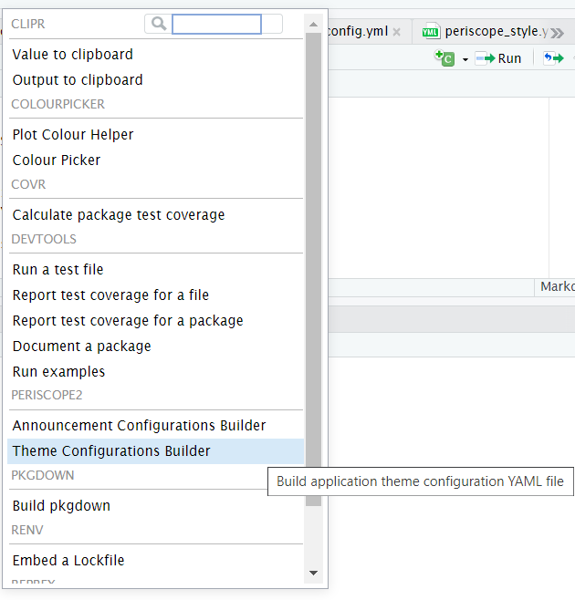
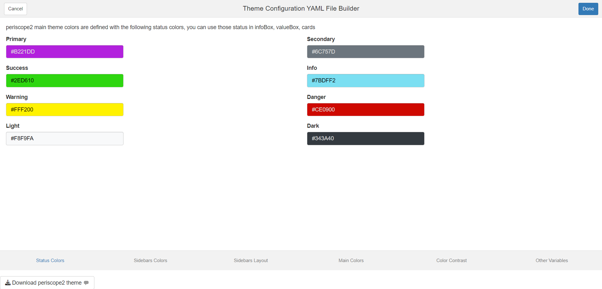
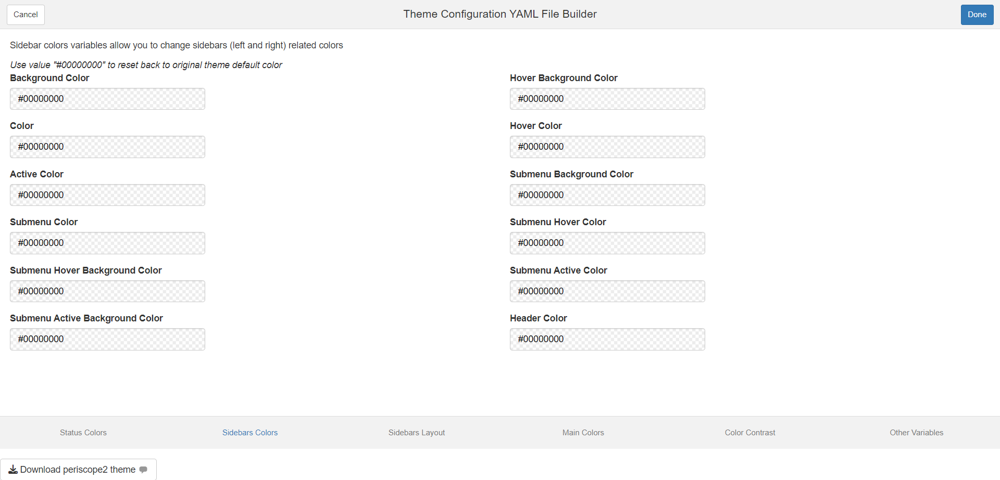
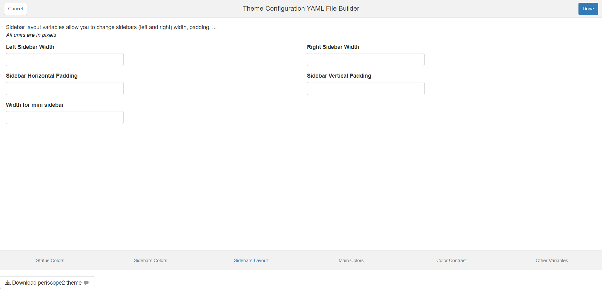
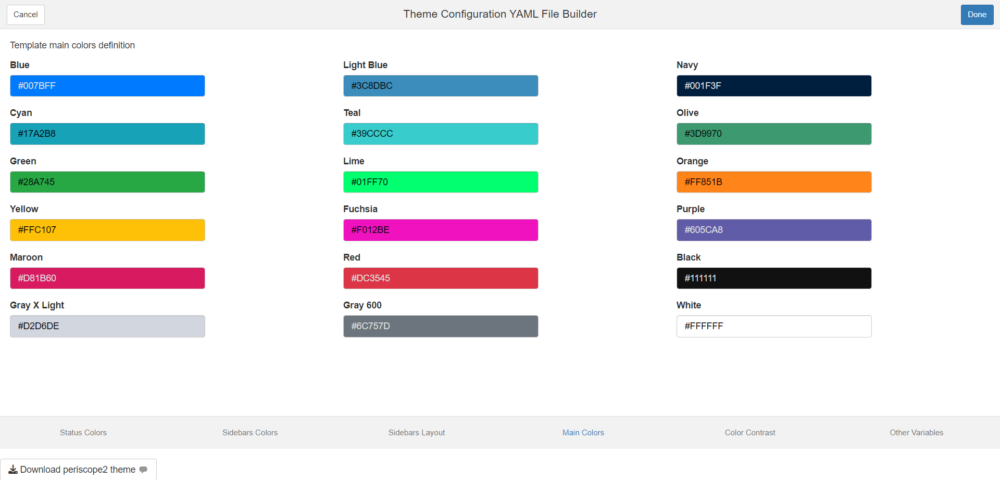
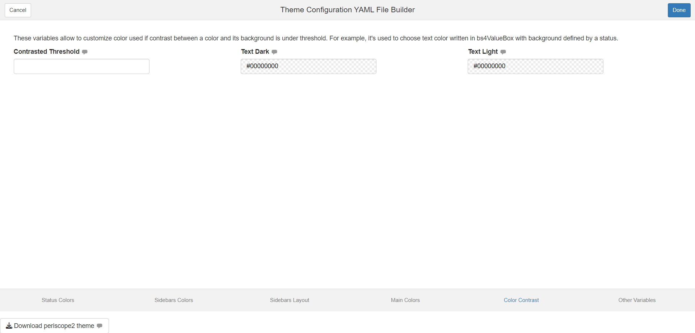
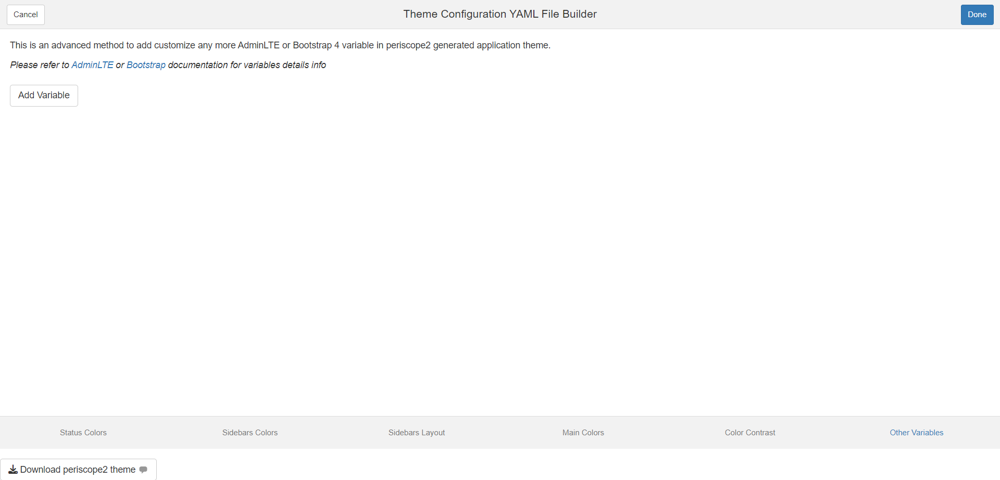
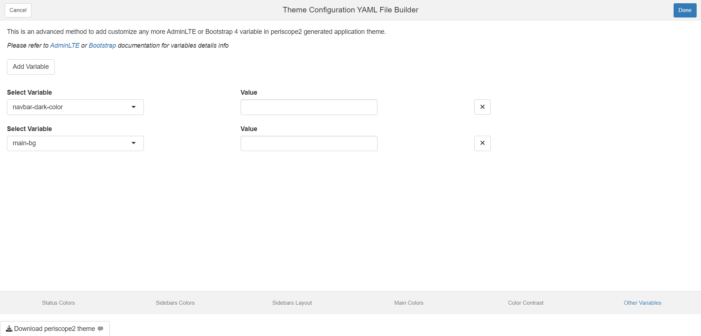
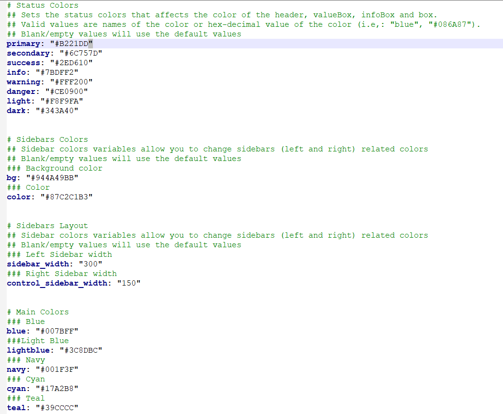

## Overview

To help package users in creating valid theme configuration file

## Add-in Launch

The add-in can be lunched by one of two methods
- Call `periscope2:::themeConfigurationsAddin()` function from within RStudio console
- From RStudio add-ins menu

{#fig-1}

## Add-in Layout

- The add-in will open as web browser tab
- Add-in UI consists of:
  - Header
  - Body
  - Footer
- Add-in header that consists of:
  - Cancel/Done buttons: they are default add-ins buttons and their solo purpose is to close add-in window
    - Upon Clicking on it, the widget add-in will be closed
  - Done button functionality can be customized but that is not needed in this add-in
    - Upon Clicking on it, the widget add-in will be closed
  - Add-in title between the two buttons is: "Theme Configuration YAML File Builder"
- Add-in body consists of 6 tabs:
  - Status Colors
  - Sidebar Colors
  - Sidebar layout
  - Main Colors
  - Colors Contrast
  - Other Variables
- Footer:
  - Download button
- No mandatory fields

## Status Colors Tab

periscope2 main theme colors are defined with the following status colors, you can use those status in infoBox, valueBox, cards

## Sidebar Colors Tab

Sidebar colors variables allow you to change sidebars (left and right) related colors

## Sidebar layout Tab

Sidebar layout variables allow you to change sidebars (left and right) width, padding, ...

## Main Colors Tab

Template main colors definition

## Colors Contrast Tab

These variables allow to customize color used if contrast between a color and its background is under threshold. For example, it's used to choose text color written in bs4ValueBox with background defined by a status

## Other Variables Tab

This is an advanced method to add customize any more AdminLTE or Bootstrap 4 variable in periscope2 generated application theme.

- User can add variables to customize by clicking "Add Variable" button
- User can remove added variables by adding remove button for that variable
- User can search for the theme variable in the selectize input

## Download Button

- Function: Download theme configuration yaml file
- Label: "Download"

## Downloaded File
Name: periscope_style.yaml
Format: Value are based on input configuration but output is similar to the following

## Downloaded Configuration File Usage
The generate file is used by putting it inside the generated app www folder where it will be located by default

* [announcement Module](announcement-module.html)
* [Announcement Configuration Builder](announcement_addin.html)
* [New Application](new-application.html)
* [downloadableTable Module](downloadableTable-module.html)
* [downloadablePlot Module](downloadablePlot-module.html)
* [downloadFile Module](downloadFile-module.html)
* [logViewer Module](logViewer-module.html)
* [applicationReset Module](applicationReset-module.html)
